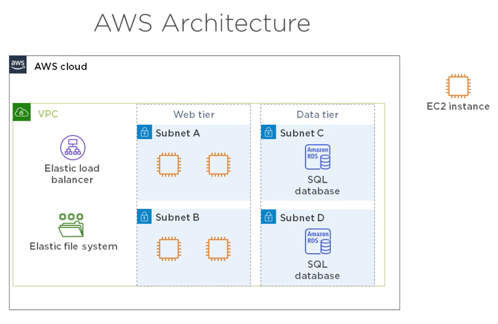
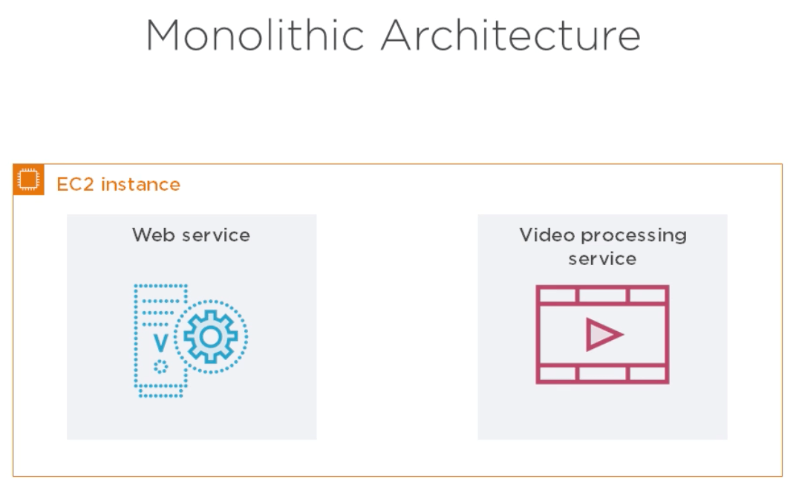
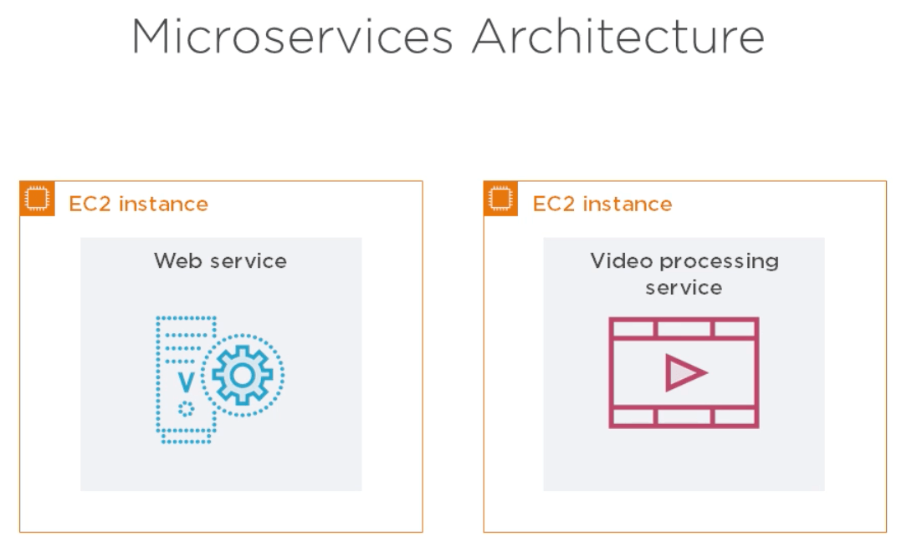
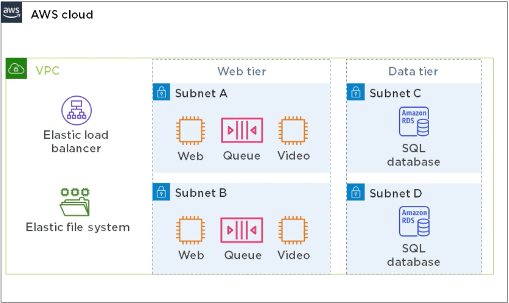

# AWS Learner 2021 <!-- omit in toc -->

Table of Contents
- [Architecting for Reliability on AWS](#architecting-for-reliability-on-aws)
	- [Architecting for Availability](#architecting-for-availability)

## Architecting for Reliability on AWS

 

### Architecting for Availability

 

**Defining Reliability, Resiliency and Availability**

*Reliability or resiliency*
> The ability of an application to avoid and recover from failure

*Availability*
> The percentage of time that an application is performing as expected\
> Poor performance implies low availability\
> Uptime isn't the same as availability

*Decide how much availability you need before designing your AWS environment*

Availability and Annual Downtime
|      99.0%      |       99.9%        |    99.99%    |  99.999%  |
| :-------------: | :----------------: | :----------: | :-------: |
| 3 days 15 hours | 5 hours 45 minutes | About 1 hour | 5 minutes |

 

**Architecting for 99.9% Availability**

*Traditional Application*
> Runs on Windows or Linux\
> You can "life and shift" it to AWS without changing its code\
> ⁃ Example: SQL-backed web application\
> How you design for availability depends on the architecture of the application

*Web-based Video Processing Application*
> Front end\
> ⁃ Web interface\
> ⁃ Video processing logic\
> Back end\
> ⁃ SQL database

*Calculating Availability - EC2*
> The service level agreement (SLA) for each service includes its annual availability\
> Availability of an EC2 instance is 90%\
> Failure rate of each instance is 10%

 

**Loose Coupling**

*Loose vs. Tight Coupling*
|                                         Loose coupling | Tight Coupling                                      |
| -----------------------------------------------------: | :-------------------------------------------------- |
| One component *doesn't* depend on a specific component | One component *does* depend on a specific component |
|                                      URL points to ELB | URLpoints directly to instance                      |
|                               One-to-many relationship | One-to-one relationship                             |

*What About EFS?*
> Elastic services are always composed of redundant components\
> Elastic services are always loosly coupled with other resources

*Redundancy and Loose Coupling*
> Redundancy ➔ loose coupling ➔ availability

*Loose Coupling and Performance*
> Independently scale resources without impacting availability\
> Performance and availability are linked\
> ⁃ Poor performance leads to low availability\
> ⁃ Good performance helps maintain availability

 

**Simple Queue Service**

*Benefits of Microservices*
> Easier updates\
> Availabitlity\
> Scalability

 

**Elastic Container Service**

*Containers*
> Behave like virtual machines\
> Let you run multiple microservices on a single instance\
> Processes running inside the container are isolated from the host

*Docker*
> Image contains everything the service needs\
> Launch containers from an image\
> Like launching EC2 instances from an AMI

*Benefits of Containers - Ease of Deployment*
> Build an image\
> Deploy it to instances\
> Launch containers from it

*Benefits of Containers - Availability*
> Having multiple containers on a single instance can give you redundancy

*Elastic Container Service*
> ECS clusters container EC2 instances\
> ECS can store containers in an elastic container registry (ECR)

*Elastic Container Service*
> A task defines how to launch containers
> ⁃ Image to use\
> ⁃ CPU\
> ⁃ Memory\
> ⁃ Instance-to-container port mappings\
> ⁃ Storage mappings

 

**Cloud Native Applications**

> depend on a cloud service that can't be deployed on-promises\
> ⁃ Examples: SQS, S3, DynamoDB\
> "Services instead of servers"\
> Availability not necessarily higher than traditional applications

*Cloud Native Application Example*
> Lambda ➔ Video processing\
> S3 ➔ Web asset and video storage\
> DynamoDB ➔ Database

*Lambda*
> Managed "serverless" compute service\
> Supports many programming languages\
> ⁃ C#\
> ⁃ Java\
> ⁃ Python\
> ⁃ Go\
> ⁃ PowerShell\
> Availability is 99.95%

*Simple Storage Service (S3)*
> Unlimited file storage\
> Static web hosting\
> Availability is 99.99%

*DynamoDB*
> Managed, nonrelational database\
> Global tables feature replicates tables across multiple regions\
> Availability with global tables is 99.999%

*Calculating Availability*
> Multiply the availability of services\
> ⁃ 99.95% × 99.9 × 99.999 = 99.85%

*Cloud Native Architecture*
|  Advantages | Disadvantages               |
| ----------: | :-------------------------- |
| Scalability | Cloud vendor lock-in        |
| Performance | Slightly lower availability |
Convenience

*Improve Availiability by Using Multiple Regions*
> Calculate the failure rate of each region\
> ⁃ 100% − 99.85% = 0.15\
> Multiply the failure rate of both regions\
> ⁃ 0.15% × 0.15% = 0.0225%\
> Subtract the product from 100%\
> ⁃ 100% − 0.0225% ≈ **99.999%**

